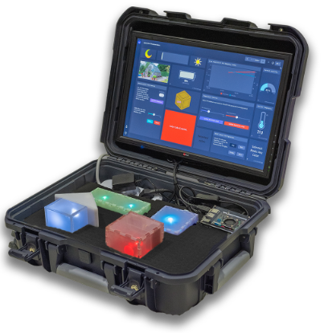
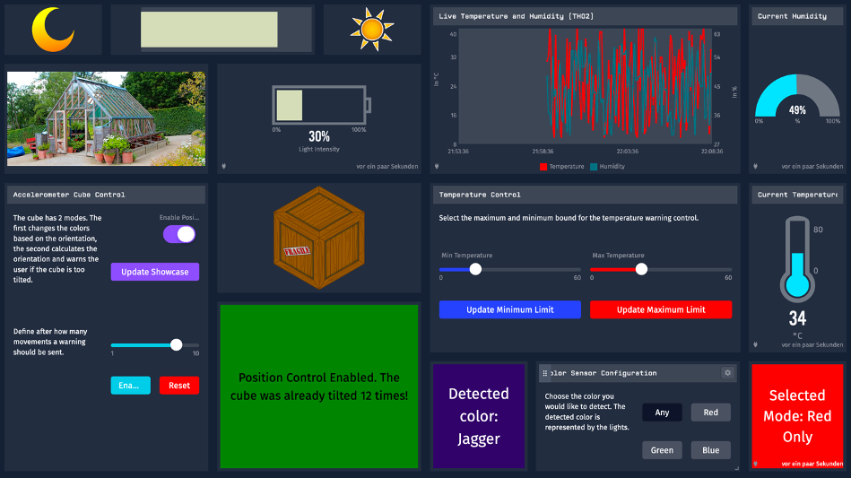

# Interactive IoT Showcase Boxes

The master's program in Business Information Systems at Frankfurt University of Applied Sciences provides the opportunity to complete the "Information Systems" course in the winter semester.
Together with representatives from the business world, who also act as clients for various topics, the students are to gain an understanding of requirements and needs in joint innovation projects between the university and various industries.
The focus here is on working on real issues regarding current trends and new technologies.

A showcase has been designed for the client, which enables them to enter the world of the Internet of Things in their first customer meetings. The Mobile IoT Showcase picks up on the versatility of IoT through interactive boxes that can demonstrate the benefits of IoT for different use cases in different industries.

# Showcase

The Mobile IoT Showcase comprises four interactive boxes, which form the basis of the Showcase. Using these four boxes, the additional value and individual use cases of the Internet of Things can be demonstrated. All four boxes are made of acrylic glass, so that the installed hardware can be seen. Furthermore, the material used allows visual feedback when used appropriately. This feedback is achieved by built-in LEDs. The boxes are designed in such a way that any hardware can be replaced at any time. The size of the boxes is adapted to the required haptics. All four interactive boxes have measurements that are suitable for easy use by simple hand movements.

  

## Hardware

The basic hardware structure of all four interactive boxes is essentially identical. The basis is an ESP32 microcontroller. In addition, each box has a power supply, one or more RGB LEDs or monochrome LEDs, and a connector for a Grove connector cable or permanently soldered cables for connecting the sensors and for the power supply.

### Sensors
* Seeed Studio Grove - I2C Color Sensor V2 TCS34725FN
* Seeed Studio Grove – Temperature & Humidity Sensor TH02
* Seeed Studio Grove - Digital Light Sensor I2C TSL2561
* Seeed Studio Grove - 3-Axis Digital Accelerometer MMA7660FC

## Software
The software solution is based on the enterprise IoT platform Losant.  The decisive advantages of Losant are the existing platform with various functionalities and connections, the multi-user system and the possibility to set up a connection without any previous technical knowledge.

The case contains four interactive boxes, a touch screen for the dashboard, a Raspberry Pi and a router for Internet access.

The Raspberry Pi is connected to the screen built into the case. When booting, the Raspberry Pi automatically executes a script that starts the installed Chromium Browser in Kiosk mode and automatically opens the dashboard.

Each interactive box consists of a so called sketch (written in C++). A sketch is the code unit that is uploaded to and executed on an ESP32 microcontroller. It consists of two important methods, `setup()` and `loop()`. The `setup()` method is called automatically at boot time. It initializes all necessary settings, such as the sensor setup. The `loop()` method is automatically called again and again. Here the board is actively controlled. Since new data about the sensors are measured again and again, these are also read and processed in the `loop()` method.

1. Temperature and humidity detection:
2. Position and acceleration detection: 
3. Colors detection: 
4. Brightness detection: 

You can easily install the Arduino IDE and start developing: [Download](https://www.arduino.cc/en/Main/Software)

Each interactive box is connected to the Losant platform. Losant provides special libraries for the connection and data exchange. The following three access data are required for authentication: LOSANT_DEVICE_ID, LOSANT_ACCESS_KEY, LOSANT_ACCESS_SECRET. Once connected to the internet and Losant, the boxes send the measured data directly to the IoT platform where they are displayed live. The user has the possibility to interact with the boxes via buttons or sliders:

  

# Contributors :sparkles:
León Mutschke, Bastian Holtermann, Kadir Akgün, Nikias Heß, Younes El Krafess

# License
